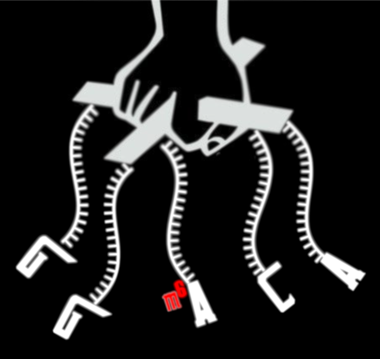

# mAFiA - (Another) m<sup>6</sup>A Finding Algorithm

Here we provide a brief walkthrough to run mAFiA, using the example of chromosome X.

## 0. Preliminary
- Get code and activate virtual environment, e.g.:
```
git clone -b package_it git@github.com:dieterich-lab/mAFiA.git
cd mAFiA
python3 -m venv mafia-venv
source mafia-venv/bin/activate
```
If you pip version is <21.3, then upgrade it to a newer version:
```
python3 -m pip install --upgrade pip
```
Install package
```
pip install -e .
```
- Download models and data from [here](https://zenodo.org/record/8321727)
    - The folder "models" contains:
        - backbone.torch: [RODAN](https://github.com/biodlab/RODAN)-based neural network for basecalling and feature extraction
        - backbone.config: training configuration for backbone
        - classifiers: pickled logistic regression models
    - The folder "data" contains a subset of input data on chr X:
        - fast5_chrX: dRNA-Seq raw data from HEK293 WT mRNA
        - GRCh38_96.X: genome reference
        - GLORI_chrX.bed: query modification sites in bed format. This file specifically corresponds to those listed in [GLORI](https://www.nature.com/articles/s41587-022-01487-9).
- Assume that data and model are unzipped to ${data} and ${model} respectively. Your output directory is ${output}
```
backbone="${models}/backbone.torch"
classifiers="${models}/classifiers"
fast5dir="${data}/fast5_chrX"
ref="${data}/GRCh38_96.X.fa"
mod="${data}/GLORI_chrX.bed"

mkdir -p "${output}"
basecall="${output}/rodan.fasta"
bam="${output}/minimap.q50.bam"
```

## 1. Basecalling
The basecalling script is adapted from the [RODAN](https://github.com/biodlab/RODAN) repository. Assume that ${mafia} is your code directory.
```
python3 ${mafia}/RODAN/basecall.py \
--fast5dir ${fast5dir} \
--model ${backbone} \
--batchsize 4096 \
--outdir ${output}
```
On a reasonably modern GPU machine, this step should take less than 30 mins.

## 2. Alignment
Align basecalling results to reference genome. Filter, sort, and index BAM file.
```
minimap2 --secondary=no -ax splice -uf -k14 -t 36 --cs ${ref} ${basecall} \
| samtools view -bST ${ref} -q50 - \
| samtools sort - > ${bam}

samtools index ${bam}
```

## 3. mAFiA
After the standard procedures, we can now measure m<sup>6</sup>A stoichiometry of the sites specified in ${mod}.
```
test_mAFiA \
--bam_file ${bam} \
--fast5_dir ${fast5dir} \
--ref_file ${ref} \
--mod_file ${mod} \
--min_coverage 50 \
--max_num_reads 1000 \
--backbone_model_path ${backbone} \
--classifier_model_dir ${classifiers} \
--mod_prob_thresh 0.5 \
--out_dir ${output}
```
The last step should take less than 1 hour. We are currently working on integrating the feature extraction step directly into basecalling. The run-time should then be significantly reduced.

In your ${output} directory, you should now see two files:
- "mAFiA.sites.bed": List of sites with coverage above minimum threshold (default 50). The column "modRatio" lists the site's stoichiometry.
- "mAFiA.reads.bam": Aligned reads identical to those in the input BAM file ${bam}, but with additional MM and ML tags that mark the location and modification probability in each individual read. The results can be visualized with, eg, [IGV](https://software.broadinstitute.org/software/igv/).

The complete HEK293 WT dataset can be downloaded from [zenodo](https://zenodo.org/record/8319583).
